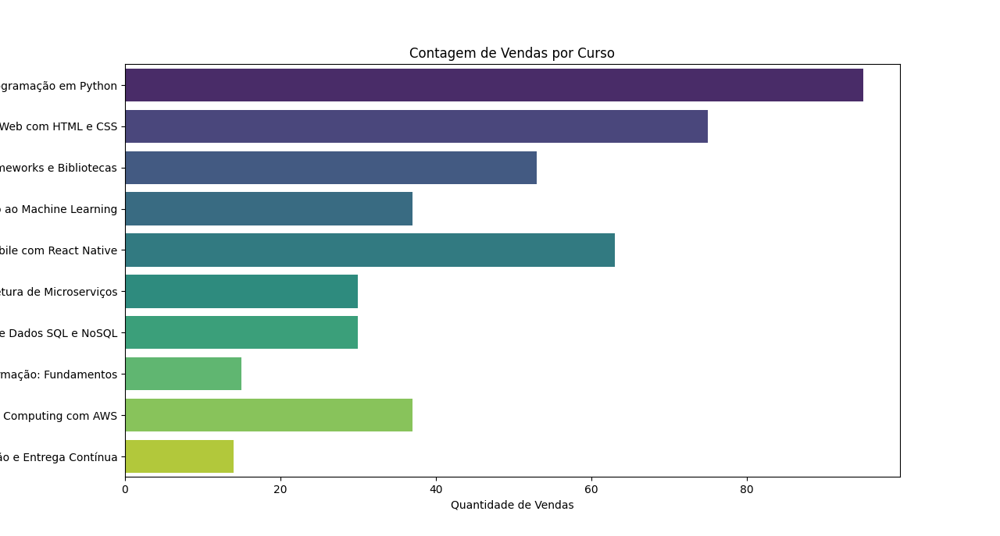
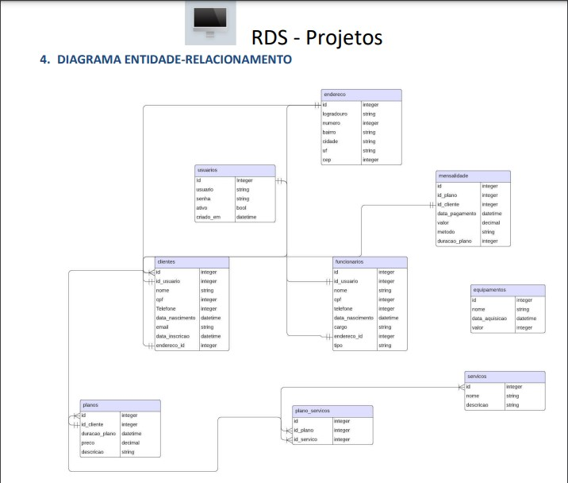
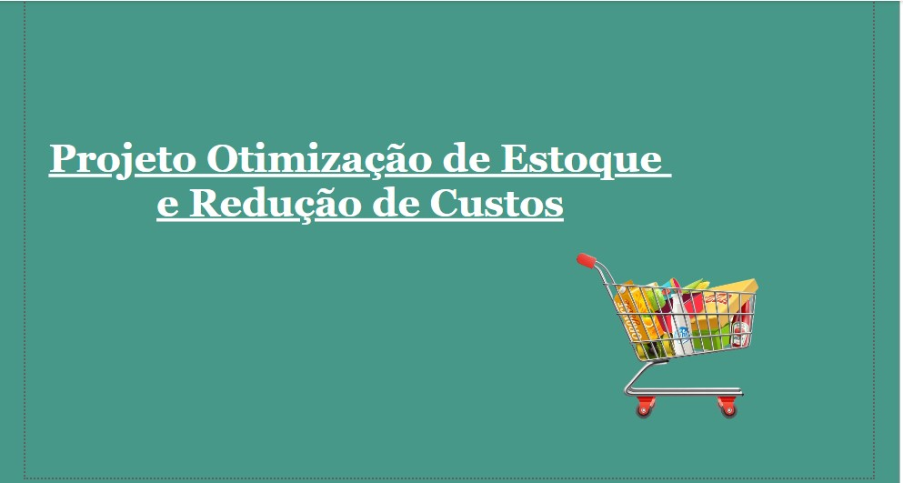
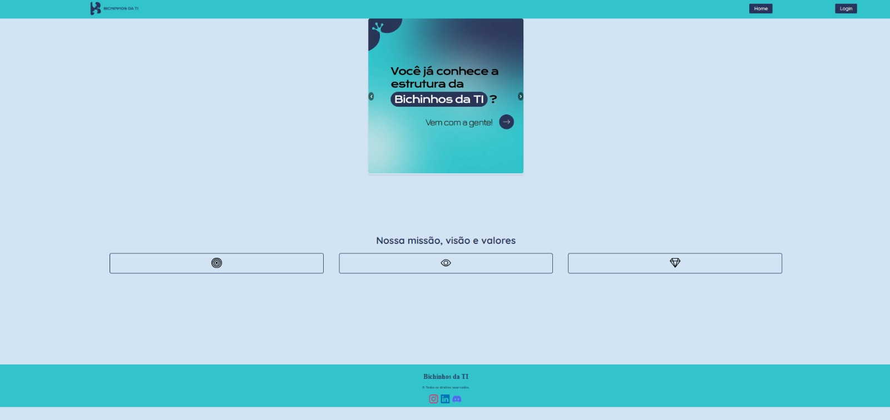
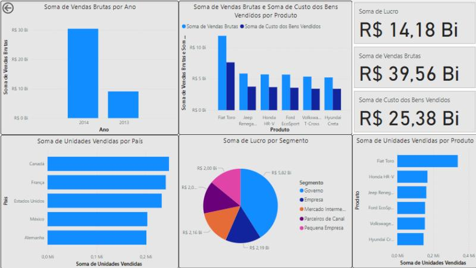

<h1 align="center">Graziele Aparecida de Godoy Justina</h1>

  

# Bem vindos ao meu portfólio de projetos

Sou uma Analista de Dados Júnior apaixonada por análises e por transformar dados em insights valiosos que geram valor para as empresas. Possuo experiência em planejamento estratégico, análise de desempenho e de indicadores, e na criação de relatórios gerenciais e operacionais, ajudando as organizações a tomarem decisões estratégicas e orientada por dados, impulsionando resultados para as empresas.

Tenho experiência em liderar equipes e gerenciar projetos, aplicando metodologias ágeis para garantir soluções assertivas e eficazes. Sou certificada como Analista de Dados pela IBM, e minhas habilidades em Data Driven e DataOps me capacitam a gerar insights que resultam em ações para melhorar o desempenho das empresas.

Possuo habilidades em SQL, Power BI, Excel e Python, com foco em desenvolver soluções de análise de dados voltadas para negócios, sempre com o objetivo de gerar valor as empresas. Tenho interesse em áreas como dados, business intelligence, negócios, e planejamento estratégico, onde aplico minha visão analítica e técnicas para resolver problemas empresariais.

Minha expertise inclui:

🚀 Soft skills

- Capacidade analítica, Tomada de decisão, Conhecimento de negócio, Gestão de projetos, Comunicação, Resolução de problemas, Trabalho em equipe, Modelagem e Análise de Dados, Mapeamento de Dados, Prototipação, Data Driven, DataOps, Storytelling, Product Discovery, Metodologias Ágeis, OKR e KPI, Homologação, Criação de Dashboards, LGPD e Documentação.

🛠️ Hard Skills:

- Excel, SQL, Python, Power BI, Google Looker Studio, Cognos Analytics, Figma, Databricks, GitHub, Git, BigQuery, Google Sheets, Google Analytics, ETL, IA Generativa e IBM Cloud.
  
---

## Projetos:

### Projeto de Análise de Dados: Satisfação da Comunidade (concluído)

**Objetivo:**: Realizar uma análise detalhada dos dados encontrados em uma pesquisa de satisfação da comunidade nos meses de junho e julho de 2024 da Edtech Código Certo Coders.

**Desafios e Expectativas**:
Realizar análise exploratória básica dos dados.
Criar visualizações simples e relatórios claros.
Utilizar ferramentas padrão de BI (Excel, Power BI, Tableau) para gerar insights.
Aplicar técnicas básicas de visualização para identificar tendências.
Produzir relatórios que apresentem os resultados de forma clara e compreensível.
Utilizar KPIs básicos, como taxa de satisfação e engajamento.

**Resultados**: Neste relatório de análise de dados, conclui-se que os voluntários estão satisfeitos e se envolvem ativamente nas atividades de voluntariado. 

Relatório de Análise de Dados para Trilha Final Ciência de Dados Jr com foco em Analista de Dados e Business Intelligence I - Nível Júnior do Código Certo Coders.

**Ferramentas utilizadas**: Visual Code Studio, Power BI, Git, Github.

**Linguagem de programação**: Python

Relatório de Análise de Dados para Trilha Final Ciência de Dados Jr com foco em Analista de Dados e Business Intelligence I - Nível Júnior do Código Certo Coders.

**Projeto**: [**Link**](https://github.com/grazielejustina/TrilhaFinalDadosJR/tree/graziele-justina)

**Competências adquiridas**: Python, Git, Github, Power Bi, Gestão de projetos

### Projeto de Análise de Dados: Cursos (concluído)
**Desafio:** Este projeto tem como objetivo realizar uma análise básica de dados utilizando Python, explorando um conjunto de dados sugerido para extrair insights simples através de estatísticas descritivas e visualizações gráficas.

**Descrição do Projeto**: O projeto consiste na análise de um conjunto de dados sobre a venda de cursos. O objetivo é explorar os dados, calcular estatísticas descritivas, gerar visualizações e obter insights. As análises realizadas ajudam a entender o desempenho das vendas dos cursos, identificar tendências e fazer recomendações baseadas nos dados.

**Ferramentas utilizadas**: Visual Code Studio, Git, Github

**Linguagem de programação**: Python

**Resultados**: Este projeto fornece uma análise abrangente dos dados de vendas de cursos, com o objetivo de oferecer insights valiosos para melhorar as estratégias de vendas e marketing.

Projeto apresentado como Trilha Inicial de Analista de Dados Júnior no Projeto Código Certo Coders.

**Projeto**: [**Link**](https://github.com/grazielejustina/trilhacodigocerto)

**Competências adquiridas**: Metodologias Agile, Python, Git, Github, Documentação de projetos, Metodologias ageis

### Projeto de Negócios: Agendamento de academias com cadastro de horários, notificações e profissionais de apoio (concluído)
**Desafio:** Desenvolver um sistema para otimizar o agendamento de aulas e a gestão de profissionais de apoio em academias, incluindo funcionalidades de cadastro de horários e envio de notificações.

**Etapas do Projeto de criação de um bando de dados**:

1- Descrição das tabelas e relacionamentos

2- Resumo dos relacionamentos

3- Código SQL 

4- Diagrama entidade relacionamento

**Ferramentas**: Lucidchart

**Resultados**: O projeto oferece uma solução completa para o gerenciamento de agendamentos em academias, com uma estrutura de dados robusta e eficiente. A implementação garante um fluxo organizado de informações e facilita a gestão de horários e comunicação com clientes.

**Projeto**: [**Link**](https://github.com/grazielejustina/projetoagendamentoacademias)

**Competências adquiridas**: Metodologias Agile · Modelagem de dados · Banco de dados · SQL · Gestão de projetos

### Projeto de Negócios: Empresa do ramo de supermercados (concluído)
**Desafio:** Otimizar o estoque e reduzir os custos de uma rede de supermercados

Contexto: A empresa enfrenta desafios na gestão de estoque, incluindo excesso de produtos perecíveis que causam desperdícios e falta de produtos que levam à perda de vendas. Este projeto busca utilizar a análise de dados para otimizar o estoque e reduzir os custos operacionais.

Objetivos do Projeto: 
1. Analisar Dados de Estoque e Vendas;
2. Prever a Demanda Futura;
3. Reduzir Desperdícios e Evitar Faltas de Produtos;
4. Melhorar a Eficiência Operacional e Reduzir Custos;
   
Para garantir a conformidade com a LGPD, todos os dados da empresa serão anonimizados, assegurando que informações sensíveis não possam ser associadas as decisões estratégicas da empresa.

**Projeto**: [**Link**](https://github.com/grazielejustina/Projeto-Otimiza-o-de-Estoque-e-Redu-o-de-Custos)
  

**Competências adquiridas**: Análise de dados, Power BI, Prototipação, Gestão de prazos, Metodologia ágeis

### Projeto de Negócios: Data Explorers (concluído)
**Desafio 1:** Apresente uma solução para otimizar o gerenciamento dos alunos e aumentar a segurança na gestão da informação e de dados pessoais
  
**Solução apresentada**: A solução apresentada pela equipe é um site onde alunos e mentores podem acessar seu cadastro, projetos, certificados e histórico de voluntariado. O site da web será integrado a um ambiente de banco de dados em nuvem.
Resultados: O projeto conquistou o segundo lugar, destacando-se pela inovação e eficácia na proposta.

**Atividades Desenvolvidas**:
Discovery e Protótipo: Criação de um modelo inicial e plano para a solução.
Demonstração e Pitch: Apresentação e defesa da solução para os avaliados.
Liderança Técnica: Coordenação de equipe, mentoria, design de arquitetura e solução de problemas.

**Ferramentas utilizadas**: Visual Code Studio, Postgresql

**Linguagens utilizadas**: Python, SQL, Javascript, CSS, HTML

**Projeto**: [**Link**](https://github.com/grazielejustina/ProjetoSistemagerenciamentoAlunos)

**Competências adquiridas**: Gestão de projetos, Metodologias Ágeis, Desenvolvimento de liderança, Gestão de prazos, Trabalho em equipe

### Projeto de Análise de Dados: Empresa do ramo de marketing (Concluído)
**Desafio:**   identificar oportunidades para aumentar a eficiência das campanhas de marketing e melhorar a experiência de compra dos clientes.
  
**Resultados Esperados**: Este projeto visa melhorar a eficácia das campanhas e a satisfação dos clientes por meio de uma análise detalhada e recomendação de otimizações baseadas em dados.

**Ferramentas utilizadas**: Power BI

Para garantir a conformidade com a LGPD, todos os dados da empresa serão anonimizados, assegurando que informações sensíveis não possam ser associadas as decisões estratégicas da empresa.

**Projeto**: [**Link**](https://github.com/grazielejustina/ProjetoTechTrends)

**Competências adquiridas**: SQL, Power BI, Metodologias ágeis, Gestão de projetos, Excel

### Projeto de Negócios: Ajuda Pet RS (Concluído)
**Desafio:** Ajuda humanitária para o Rio Grande do Sul
  
**Objetivo**: Proposto como solução do Desafio 4- Assistência Humanitária com intuito de propor soluções para crise humanitária que está sendo enfrentada pelo Rio Grande do Sul na Maratona Tech pelo RS. Todos os participantes tiveram o prazo de 48 horas para desenvolver e apresentar sua solução.

**Solução apresentada**: Levantar todos os dados sobre quantidade e necessidades de abrigos em um sistema de banco de dados para integrar todas as informações sobre os abrigos, pontos de coleta e transporte de itens para as regiões, e assim gerar um volume importante de conhecimentos sobre todos locais que precisam de ajuda.

**Ferramentas utilizadas**: Power BI, SQL Server

**Projeto**: [**Link**](https://github.com/grazielejustina/Projeto-Ajuda-Pet-RS)

**Competências adquiridas**: Análise de dados, Power BI, Prototipação, Gestão de prazos, Mapeamento de necessidades

### Projeto de Análise de Dados: Empresa do ramo da educação (Concluído)
**Desafio:**  Identificar o perfil, interesses e conhecimento de ferramentas de tecnologia dos líderes específicos em se matricular em uma escola de tecnologia.
  
**Resultados**: Esse projeto visa utilizar dados dos leads para entender melhor seu perfil e interesses, ajudando a escola a adaptar suas estratégias e ofertas educacionais de forma mais eficaz.

**Ferramentas utilizadas**: Power BI

Para garantir a conformidade com a LGPD, todos os dados da empresa serão anonimizados, assegurando que informações sensíveis não possam ser associadas as decisões estratégicas da empresa.

**Projeto**: [**Link**](https://github.com/grazielejustina/ProjetoEscoladeTecnologia)

**Competências adquiridas**: SQL, Power BI, Metodologias ágeis, Gestão de projetos, Excel

### Projeto de Análise de Dados: Empresa do ramo automobilístico (Concluído)
**Desafio:** Desenvolver um dashboard interativo para fornecer um relatório geral de desempenho de vendas da empresa AutoSolutions.
  
**Resultados Esperados**: Melhoria na tomada de decisões, aumento da eficiência operacional e incremento nas vendas.

**Ferramentas utilizadas**: Power BI

Para garantir a conformidade com a LGPD, todos os dados da empresa serão anonimizados, assegurando que informações sensíveis não possam ser associadas as decisões estratégicas da empresa.

**Projeto**: [**Link**](https://github.com/grazielejustina/ProjetoAutoSolutions)

**Competências adquiridas**: SQL, Power BI, Metodologias ágeis, Gestão de projetos, Excel

### Projeto de Análise de Dados: Empresa do ramo de fast food (Concluído)
**Desafio:** Desenvolver um dashboard interativo para melhorar as operações e a estratégia de vendas da empresa BiteSpeed.
  
**Resultados Esperados**: Melhoria na tomada de decisões, aumento da eficiência operacional e incremento nas vendas.

Para garantir a conformidade com a LGPD, todos os dados da empresa serão anonimizados, assegurando que informações sensíveis não possam ser associadas as decisões estratégicas da empresa.

**Ferramentas utilizadas**: Power BI

**Projeto**: [**Link**](https://github.com/grazielejustina/ProjetoBiteSpeed)

**Competências adquiridas**: SQL, Power BI, Metodologias ágeis, Gestão de projetos, Excel
  
---

### Contatos:

* WhatsApp: (14) 99722-6510
* Linkedin: [**Link**](https://www.linkedin.com/in/grazielejustina/)
* Email: grazielejustina@hotmail.com
